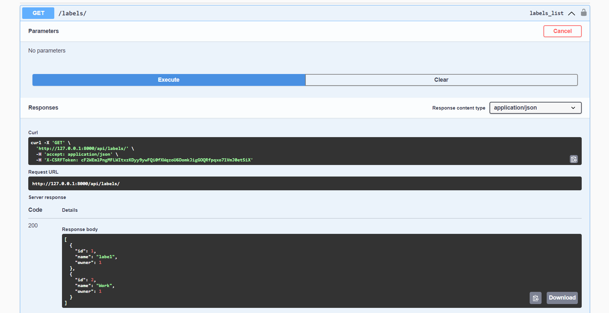
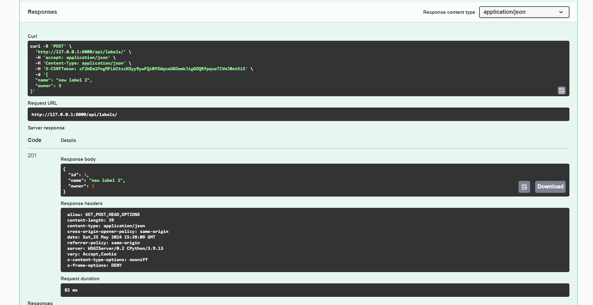
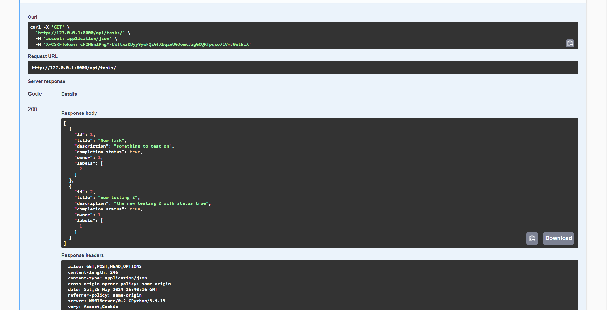
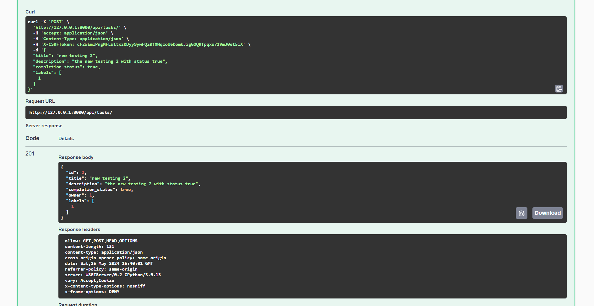

# Backend Developer Challenge

## Overview

This project is task management system with CRUD operations for tasks and labels, user authentication, and authorization. It was developed using Django and Django Rest Framework.

## Features

1. **Models:**
   - **Task:** Stores information about tasks including title, description, completion status, owner, and labels. Also, the label has a many-to-many relationship.
   - **Label:** Stores labels associated with tasks and their owner. Label contains owner and name, where name has unique constraints.

2. **API Endpoints:**
   - CRUD operations for tasks and labels.
   - User authentication and authorization to ensure users can only manipulate their own data.

3. **User Authentication:**
   - Implemented using Django Rest Framework's authentication classes.


4. **Swagger Documentation:**
   - Interactive API documentation using Swagger. Added as addtional feature to view all the apis.

## Setup Instructions

1. **Clone the repository:**
   ```bash
   git clone https://github.com/alphapara97/backend-developer-challenge.git
   cd backend-developer-challenge

2. **Set Up a Virtual Environment and Install Dependencies:**
    ```bash
    python -m venv env
    #widnows use `env\Scripts\activate`
    #mac use `source env/bin/activate`  
    pip install -r requirements.txt

3. **Run Migartions:**
    ```bash
    python manage.py makemigrations
    python manage.py migrate

4. **Create a Superuser to Access the Admin Site:**
    ```bash
    python manage.py createsuperuser

5. **Running Tests:**
    ```bash
    python manage.py test tasks

6. **Run the Development Server:** 
    ```bash
    python manage.py runserver


**Users for Admin Site**  
  
To log into the Django admin site, you can use the superuser credentials you created earlier.  
  
Alternatively, you can use the following sample users:    
  
Username: user1, Password: akkpass123  
Username: user2, Password: akkpass123  
  
7. **Access the API Documentation:**
    
    Swagger UI: http://127.0.0.1:8000/swagger/


## ScreenShots from Swagger:  

**Get Labels:** 



**Post Labels:**   

  


**Get Tasks:**

  


**Post Tasks:** 

  


**Author:** Ansuman Sasmal  
**Email:** ansuman.sasmal97@gamil.com  
**Date:** May 25, 2024